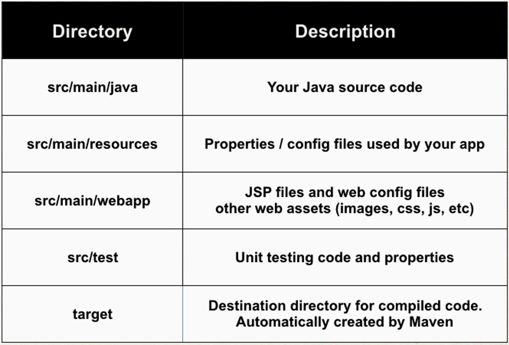
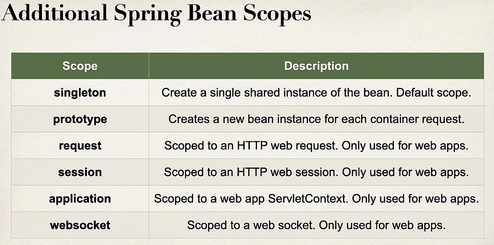
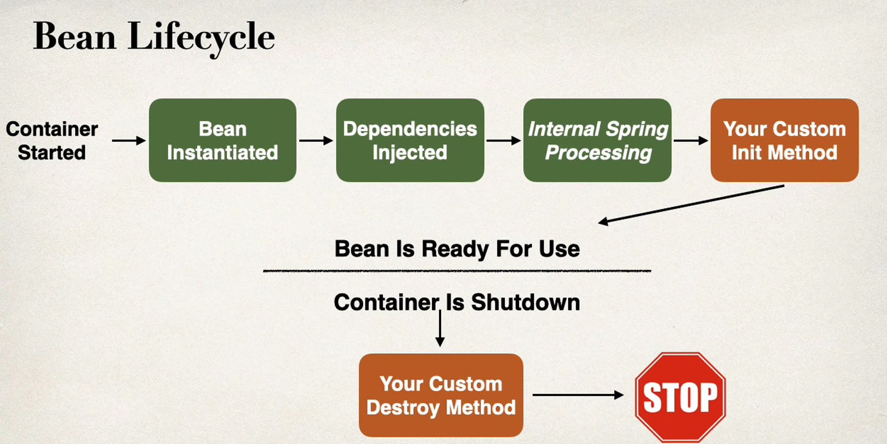

# Spring-Boot-3-Spring-6-Hibernate-for-Beginners

## 1. Spring in a Nut Shell
- Very popular framework for building java applications
- Provides a large number of helper classes and annotations

### The Problem
- Build a traditional Spring Application is really HARD!!!
- for examples
    1. which JAR dependencies do i need?
    2. How do i set-up configuration(xml or java)?
    3. How do i install the server? (Tomcat, JBoss, etc)

### Spring Boot Solution
- Make it easier to get started with Spring development
- Minimize the amount of manual configuration, Perform auto-configurations based on props files and JAR classpath
- Help to resolve dependency conflicts(Maven or Gradle)
- Provide an embedded HTTP server so you can get started quickly (Tomcat, Jetty, Undertow,..)

### Spring Boot and Spring

- Spring Boot uses Spring behind the scenes
- Spring Boot simply makes it easier to use Spring

### [Spring Initializr](https://start.spring.io/)
- Quickly create a starter Spring Boot project
- Select your dependency
- Create a Maven/Gradle project
- Import the project into your IDE(Eclipse, Intellij, NetBeans, etc...)

### Spring Boot Embedded Server

- Provides an embedded HTTP server so you can get started quickly(Tomcat, Jetty, Undertow,...)
- No need to install a server seperately

### Running Spring Boot Apps
- Spring Boot apps can be run standalone (includes embedded server)
- Run the spring boot app from the IDE or command-line

### Deploying Spring Boot Apps

- Spring Boot apps can also be deployed in the traditional way.
- Deploy WAR file to an external server. Tomcat, JBoss, WebSphere, etc...

## 2. Spring Boot Initializr Demo

### Quick Word on Maven
- When building your java project, you may need additional JAR files(for example: Spring, Hibernate, Commons Loggin, JOSN, etc..)
- One approach is to download the JAR file from each project website & manually add the JAR file to your classpath/PATH

### Maven Solution
- Tell Maven the projects you are working with(dependencies Spring, Hibernate, etc...)
- Maven will go out and download the jAR files for those projects for you and Maven will make those JAR files available during compiple/runtime.
- Think of Maven as your friendly helper/ personal shopper :-)

## 3. Create a REST Controller

Sample code snippet for basic rest controller which returns "Hello World!"

```java
import org.springframework.web.bind.annotation.GetMapping;
import org.springframework.web.bind.annotation.RestController;

@RestController
public class FunRestController {
    // expose "/" that returns "Hello World"

    @GetMapping("/")
    public String sayHello() {
        return "Hello World!";
    }
}
```

## 4. Spring Framework overview

- Lightweight development with Java POJOs(Plain-Old-Java-Objects)
- Dependency injection to promote loose coupling
- Minimize boilerplate java code

### Various Sections in Spring Framework

- Core Container :- Factory for creating beans, Manage bean dependencies
- Infrastructure :- AOP(Aspect Oriented Programming) Add functionality to objects declaratively Logging, Security, transactions, etc..
- Data Access Layer :- JDBC helper classes Reduce your JDBC code by 50%. Also provides Object to relational mapping Integration with Hibernate and JPA.
- Web Layer :- All web related classes Home of the Spring MVC framework.
- Test Layer :- Supports Test-Driven-Development(TDD) Mock objects and out-of-container testing.

## 5. [Spring Projects](https://spring.io/projects)

- Additional Spring modules build-on top of the core Spring Framework
- Only use what you need...
   1. Spring Cloud, Spring Data, Spring Batch, Spring Security, Spring Web Services, Spring LDAP, etc..

## 6. What is Maven?

- Maven is a Project Management tool
- Most popular use of Maven is for build management and dependencies

### What Problems Does Maven Solve?

- When building your Java Project, you may need additional JAR files for example: Spring, Hibernate, Commons Logging, JSON, etc...
- One approach is to download the JAR files from each project website & Mmanually add the JAR files to your build path/ classpath

### Maven Solution

- Tell Maven the projects you are working with(dependencies) Spring, Hibernate, etc
- Maven will go out and download the JAR files for those projects for you and maven will make those JAR files available during compile/ runtime
- Think of Maven as your friendly helper/ personal shopper :-)

### How Maven works?

- First Maven reads the config file and checks if the Maven local repository does not have those files It will look for those files inside the Maven Central Repository(Remote)
- Then it will save versions of those files in your local repository and then it will use that to build and run.
- Maven also handle JAR dependencies. It will also download the supporting dependencies.

### Maven Directory Structure


### Maven key concepts

- POM File (pom.xml) :- Project Object Model file which acts as a shopping list for us.
- It has three parts :-
  1. project meta data :- Project name, version, etc Output file type: JAR, WAR,...
  2. dependencies :- List of projects we depend on Spring, Hibernate, etc...
  3. plugins :- Additional custom tasks to run: generate Junit test reports etc...

### Maven Wrapper files

- mvwn allows you to run a Maven project, No need to have Maven installed or present on your path
- If correct version of Maven is NOT found on your computer it automatically downloads correct version and runs Maven.

## 7. Spring Boot Actuators

### Problem
- How can i monitor and manage my application?
- How can i check the application health?
- How can i access application metrics?

### Solution: Spring Boot Actuators

- Exposes ednpoints to monitor and manage your application
- You easily get Devops functionality out-of-the-box
- Simply add the dependency to your POM file
- REST endpoints are automatically added to your application

### Exposing Endpoints

- By default, only /health is exposed
- The /info endpoint can provide information about your application
- To expose /info

Code Snippet for exposing endpoints
```
management.endpoints.web.exposure.include=health,info
management.info.env.enabled=true
```

### What about Security?

- You may not want to expose all of this information
- Add Spring Security to project and endpoints are secured :-)


### How to add Custom Application Properties

- Define those properties in application.properties file
- use those properties in your application/ controller

Code snippet for Custom Application Properties
```java
    // inject properties for: coach.name and team.name

    @Value("${coach.name}")
    private String coachName;

    @Value("${team.name}")
    private String teamName;

    // expose a new endpoint for "teaminfo"

    @GetMapping("/teaminfo")
    public String getTeamInfo() {
        return "Coach: " + coachName + ", Team: " + teamName;
    }
```

## 8. Inversion of Control(IoC)

It is the approach of outsourcing the construction and management of objects.
We can achieve Inversion of Control through various mechanisms such as: Strategy design pattern, Service Locator pattern, Factory pattern, and Dependency Injection (DI).

### Dependency Injection

- The dependency inversion principle : The client delegates to another object the responsibility of providing its dependencies.
- Dependency Injection (DI) is a design pattern commonly used in software development, and Spring Framework is a popular Java framework that provides comprehensive support for DI. In Spring, DI is primarily implemented through inversion of control (IoC), where the control of object creation and wiring is shifted from the application code to the Spring container.
- There are two types of Injections :-
  1. Constructor Injection - use this when you have required dependencies
  2. Setter Injection - use this when you have optional dependencies

### What is Spring AutoWiring?

- For dependency injection, Spring can use autowiring
- Spring will look for a class that matches and will automatically inject it...hence it is autowired.

### Example Application for Dependency Injection


### Development Process - Constructor Injection

- Define the dependency interface & class
- Create Demo REST Controller
- Create a constructor in your class for injections
- Add @GetMapping for /dailyworkout

NOTE : When we mark a class with the @Component annotation it marks the class as a Spring Bean and makes it a candidate for dependency injection. Spring Bean is just a regular java class that is managed by Spring

### Component Scanning

- Spring will scan your java classes for special annotations eg. @Component, etc and it will automatically register the beans in the Spring Container.
- Spring Boot does auto scanning for all the packages that fall under the parent package. 
- If you want spring to scan other packages you need to add them.

### Setter Injection
When we inject dependencies by calling setter methods of your class.

### Development Process - Setter Injection

- Create setter method in your class for injections
- Configure the dependency injection with @Autowired Annotation

### Annotations Autowiring & Qualifiers

### Autowiring

- Injecting a demo Coach interface
- Spring will scan @Components
- Any one implements Coach interface???
- If so Let's inject them..... but which one???
- To solve this problem Be Specific & use @Qualifier
- Use the same name as class just first character lower-case

### Alternate Solution to the above problem

- Use @Primary annotations which will return primary coach
- When using @Primary, can have only one for multiple implementations
- If you mark multiple classes as primary we have a problem
- You can use Qualifier and @Primary together but Qualifier will have higher priority

### Lazy Initilization

- Instead of creating all the beans up-front, we can specify lazy initialization
- A bean will only be initialized in the following cases:
  1. It is needed for dependency injection
  2. Or it is explicitly requested
- To configure other beans for lazy initialization we would need to add @Lazy to each class

### Advantages

- Only create objects as needed
- May help with faster startup time if you have large number of components

### Disadvantages

- If you have a web related components like @RestController, not created until requested
- May not discover configuration issues until too late
- Need to make sure you have enough memory for all the beans once created\


### Bean Scopes

- Scope refers to the lifecycle of a bean
- How long does the bean live?
- How many instances are created?
- How is the bean shared?

NOTE: Defauult Scope in Spring is Singleton

### What is Singleton?
- Spring Container creates only one instance of the bean, by default
- It is cached in memory
- All dependency injections for the bean will reference the SAME bean.



### Bean Lifecycle



### Development Process

- Define your methods for init and destroy
- Add annotations: @PostConstruct and @PreDestroy

NOTE: Prototype Beans and Lazy Initialization - Prototype beans are lazy by default. There is no need to use the @Lazy annotation for prototype scopes beans

### Java Config Bean

- We will not be using @Controller this time instead we will be doing it using java code

### Development Process

- Create @Configuration class
- Define @Bean method to configure the beam
- Inject the beam into our controller

## Hibernate

- What is Hibernate
- Benefits of Hibernate
- What is JPA
- Benefits of JPA

### What is Hibernate?
A framework for persisting/saving Java objects in a database

### Benefits of Hibernate

- Hibernate handles all the low-level SQL
- Minimizes the amount of JDBC code you have to develop
- Hibernate provides the Object-to-Relational Mapping(ORM)

### Object-To-Relational Mapping(ORM)
The developer define mapping between Java class and database table

### What is JPA?

Jakarta Persistence API(JPA)...previously known as Java persistence API. It is a standard API for Object-to-Relational-Mapping(ORM)

### Benefits of JPA

- By having a standard API, you are not locked to vendor's implementation
- Maintain portable, flexible code by coding to JPA spec(interfaces)
- Can theoretically switch vendor implementations

### Relationship between Hibernate/JPA & JDBC

- Hibernate/JPA uses JDBC for all database communications

### MySQL Database

- MySQL includes two components
  1. MySQL Database Server
  2. MySQL Workbench
- MySQL Database Server : MySQL Database Server is the main engine of the database, supports CRUD features on the data
- MySQL Workbench : Client GUI for interacting with the database

### creating a new user in MySQL datbase

```mysql
-- Drop user first if they exist
DROP USER if exists 'springstudent'@'%' ;

-- Now create user with prop privileges
CREATE USER 'springstudent'@'%' IDENTIFIED BY 'springstudent';

GRANT ALL PRIVILEGES ON * . * TO 'springstudent'@'%';
```

### creating student table

```mysql
CREATE DATABASE  IF NOT EXISTS `student_tracker`;
USE `student_tracker`;

--
-- Table structure for table `student`
--

DROP TABLE IF EXISTS `student`;

CREATE TABLE `student` (
  `id` int NOT NULL AUTO_INCREMENT,
  `first_name`varchar(45) DEFAULT NULL,
  `last_name` varchar(45) DEFAULT NULL,
  `email` varchar(45) DEFAULT NULL,
  PRIMARY KEY (`id`)
) ENGINE=InnoDB AUTO_INCREMENT=1 DEFAULT CHARSET=latin1;


```

### Set-up Spring Boot Project

- In Spring Boot Hibernate is the default implementation of JPA
- EntityManager is main component for creating queries etc...
- EntityManager is from Jakarta Persistence API(JPA)
- Based on the config, Spring Boot will automatically create the beans: DataSource, EntityManager, ...
- You can inject them into your app, for example your DAO.

### JPA Development Process

- Annotate java class
- Develop java code to perform database operations
- @Entity Class - Java class that is mapped to a database table

### Steps for saving a java obejct using DAO

- Define DAO Interface
- Define DAO implementation and inject the entity manager
- Update main app

### Retriving a Java Object with JPA

- Add new method to DAO interface
- Add new method to DAO implementation
- Update main app


 


